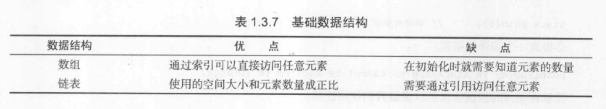
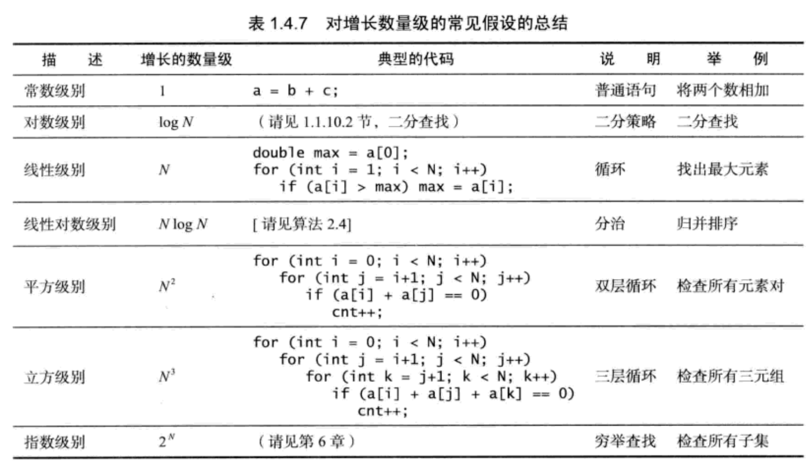
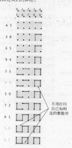
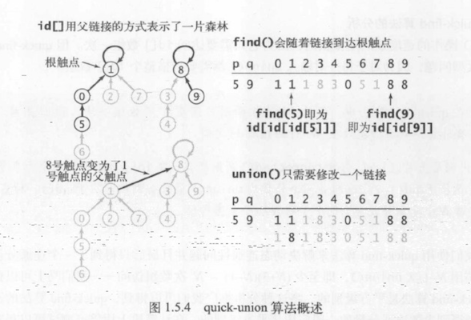
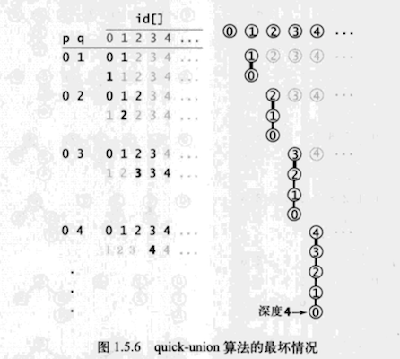
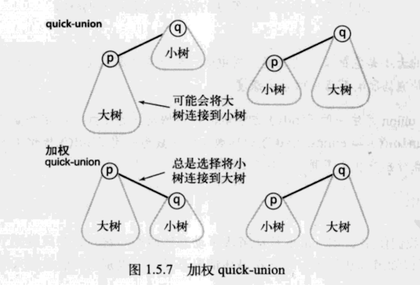

# 《算法》第一章学习笔记js实现

目标：总结本书主要内容，相应算法使用js来模仿实现

> 在计算机科学领域，我们用算法这个词来描述一种有限、确定、有效的并适合用计算机程序来实现的解决问题的方法。

> 我们关注的大多数算法都需要`适当地组织数据`，而为了组织数据就产生了`数据结构`

**原书所有代码是基于JAVA语法的，这里，我们使用js来实现所有算法逻辑**

## 队列、栈的实现

> 队列是一种先进先出的集合类型，栈是一种先进后出的集合类型

首先定义要实现的队列、栈的API

 **Queue** | 说明
--- | ---
Queue() | 创建空队列
enqueue(item) | 添加一个元素
dequeue()| 删除最近添加的元素
isEmpty() | 队列是否为空
size（）| 队列中元素的数量
iterator() | 返回一个可迭代对象
---

 **Stack** | 说明
--- | ---
Stack() | 创建空栈
push(item) | 添加一个元素
pop()| 删除最近添加的元素
isEmpty() | 栈是否为空
size（）| 栈中元素的数量
iterator() | 返回一个可迭代对象

---

Iterator | 说明 
--- | ---
hasNext() | 是否还有下一个元素 
next() | 返回下一个元素


- ### 数组方式

由于JS语言的特殊性，采用数组的方式来实现队列、栈是非常容易的,js中数组本来就提供了从头部插入、删除元素，从尾部插入、删除元素的功能。这里只需要简单的封装一下(js的弱类型特点，不需要像JAVA那样采用泛型来声明可以储存任意类型的数据，同时，js中数组是不定长的，可以动态扩展)

**实现**

队列的数组方式实现，并模拟可迭代功能

```
function Queue() {
    this.container = []
}
Queue.prototype.enqueue = function (ele) {
    this.container.push(ele)
}
Queue.prototype.dequeue = function () {
    return this.container.shift()
}
Queue.prototype.isEmpty = function () {
    return !this.container.length
}
Queue.prototype.size = function () {
    return this.container.length
}

Queue.prototype.iterator = function () {
    var container = this.container
    var current = 0
    return {
        hasNext: function () {
            return current !== container.length
        },
        next: function () {
            return container[current++]
        }
    }
}

用例:
var Qu = new Queue()
Qu.enqueue('to')
Qu.enqueue('be')
Qu.enqueue('or')
Qu.enqueue('not')
Qu.dequeue()
var iterator = Qu.iterator()
while (iterator.hasNext()) {
    console.log(iterator.next())
}
输出:
be
or
not

```

栈的数组方式实现，并模拟可迭代功能

```
 class Stack {

    constructor() {
        this.container = []
    }

    push(ele) {
        this.container.unshift(ele)
    }

    pop() {
        return this.container.shift()
    }

    isEmpty() {
        return !this.container.length
    }
    size() {
        return this.container.length
    }

    iterator() {
        const container = this.container
        let current = 0
        return {
            hasNext: function () {
                return current !== container.length
            },
            next: function () {
                return container[current++]
            }
        }
    }

}
用例:
var St = new Stack()
Stack.push('to')
Stack.push('be')
Stack.push('or')
Stack.push('not')
Stack.pop()
var iterator = Stack.iterator()
while (iterator.hasNext()) {
    console.log(iterator.next())
}
输出:
or
be
to
```

- ### 链表方式实现

> 链表是一种递归的数据结构，它或者为空(null)，或者是指向一个结点(node)的引用，该结点含有一个泛型的元素和一个指向另一个链表的引用。

在这个定义中，结点是一个可能含有任意类型数据的抽象实体，它所包含的指向结点的应用显示了它在构造链表之中的作用。

结点表示:

```
    function Node(){
        this.item=null
        this.next=null
    }
```

构造链表：


在表头插入结点
```
    var oldFirst=first
    first=new Node()
    first.next=oldFirst
```

从表头删除结点
```
    first=first.next
```

从表尾插入结点
```
    var oldlast=last
    lst=new Node()
    oldlast.next=last
```

> 实现任意插入和删除操作的标准解决方案是双向链表，其中每个结点都含有两个链接，分别指向不同的方向

- 栈的链表实现

```

function Node(item) {
    this.item = item
    this.next = null
}

function Stack() {
    this.count = 0 //元素数量
    this.first = null //指向栈顶
}

Stack.prototype.isEmpty = function () {
    return this.first == null
}
Stack.prototype.size = function () {
    return this.count
}
Stack.prototype.push = function (ele) {
    var oldfirst = this.first
    var newnode = new Node(ele)
    newnode.next = oldfirst
    this.first = newnode
    this.count++
}
Stack.prototype.pop = function () {
    var ele = this.first.item
    this.first = this.first.next
    this.count--
    return ele
}
Stack.prototype.iterator = function () {
    var firstnode = this.first
    var count = this.count
    return {
        hasNext: function () {
            return  count
        },
        next: function () {
            var ele=firstnode.item
            firstnode=firstnode.next
            count--
            return ele
        }
    }
}
用例：
var stack=new Stack()
stack.push('to')
stack.push('be')
stack.push('or')
stack.push('not')
stack.push('to')
stack.push('be')
console.log(stack.size())
var iterator=stack.iterator()
while(iterator.hasNext()){
    console.log(iterator.next())
}
输出：
6
be
to
not
or
be
to
```

- 队列的链表实现

> 将链表表示为一条从最早插入的元素到最近插入的元素的链表，实例变量first指向队列的开头，last指向队列的结尾。这样，要讲一个元素入列，就将它添加到表尾，要将一个元素出列，就删除表头的结点.

```
function Node(item) {
    this.item = item
    this.next = null
}

class Queue {

    constructor() {
        this.first = null
        this.last = null
        this.count = 0
    }

    isEmpty() {
        return this.first == null
    }
    size() {
        return this.count
    }
    enqueue(item) {
        const oldlast = this.last
        const last = new Node(item)
        this.last = last
        if (this.isEmpty()) {
            this.first = last
        } else {
            oldlast.next = last
        }
        this.count++
    }
    dequeue() {
        const ele = this.first.item
        this.first = this.first.next
        if (this.isEmpty()) {
            this.last = null
        }
        this.count--
        return ele
    }
    iterator() {
        let firstnode = this.first
        let count = this.count
        return {
            hasNext: function () {
                return count
            },
            next: function () {
                var ele = firstnode.item
                firstnode = firstnode.next
                count--
                return ele
            }
        }
    }
}
用例:
const queue=new Queue()
queue.enqueue('to')
queue.enqueue('be')
queue.enqueue('or')
queue.enqueue('not')
queue.enqueue('to')
queue.enqueue('be')
queue.dequeue()
console.log(queue.size())
const iterator=queue.iterator()
while(iterator.hasNext()){
    console.log(iterator.next())
}

输出:
5
be
or
not 
to
be
```

>在结构化存储数据集时，链表是数组的一种重要的替代方式，两者都非常基础，常常被称为顺序存储和链式存储。




## 常见的时间复杂度的级别


- ### threeSum问题分析

问题描述：

> 假设所有整数都不相同，统计一个数组中所有和为0的三整数元组的数量

- 最基本的实现,暴力算法

```
function threesum(arr){
    var N=arr.length
    var count=0
    for(var i=0;i<N;i++){
        for(var j=i+1;j<N;j++){
            for(var k=j+1;k<N;k++){
                if(arr[i]+arr[j]+arr[k]==0){
                    count++
                }
            }
        }
    }
    return count
}

```

分析：

执行最频繁的指令决定了程序执行的总时间，对上面的threesum算法，最频繁的部分就是if语句判断，它套在三个for循环内，对于给定的N，if语句执行次数为`N*(N-1)*(N-2)/6=N^3/6-N^2/2+N/3`,当N很大时，首项后的其他项都相对较小可以忽略，所以if语句的执行次数约等于`N^3/6`,表示为(~N^3/6)

所以暴力算法的threesum执行用时的增长数量级为`N^3`

- 优化

> 学习程序的增长数量级的一个重要动力是为了帮助我们为同一个问题设计更快的算法

改进后的算法的思路是：当且仅当-( a[i]+a[j] )在数组中( 不是a[i]也不是a[j] )时,整数对( a[i]和a[j] )为某个和为0的三元组的一部分。要解决这个问题，首先对数组进行排序(为二分查找做准备),然后对数组中的每个a[i]+a[j],使用二分查找算法对-(a[i]+a[j])进行二分查找，如果结果为k，且k>j,则count加一。

下面中的代码会将数组排序并进行N*(N-1)/2次二分查找，每次查找所需的时间都和logN成正比，因此总的运行时间和N^2logN成正比。

```
//二分查找
function binarySearch(key, arr) {
    var start = 0
    var end = arr.length - 1
    while (start <= end) {
        var mid = start + Math.floor((end - start) / 2)
        if (key < arr[mid]) {
            end = mid - 1
        } else if (key > arr[mid]) {
            start = mid + 1
        } else {
            return mid
        }
    }
    return -1
}

function threesum(arr) {
    var N = arr.length
    var count = 0
    arr = arr.sort(function (a, b) {
        return a > b ? 1 : -1
    })
    for (var i = 0; i < N; i++) {
        for (var j = i + 1; j < N; j++) {
            if (binarySearch(-arr[i] - arr[j], arr) > j) {
                count++
            }
        }
    }
    return count
}
```

- 增长数量级的分类




## 案例研究:union-find算法

### 动态连通性问题

首先我们详细说明一下问题

> 问题的输入是一列整数对，对于一对整数p,q,如果p,q不相连，则将p,q连接

所谓的相连:

[x] 自反性: p与p是相连的

[x] 对称性: 若p与q是相连的,则q与p是相连的

[x] 传递性: 若p与q是相连的,且q和r相连，则p与r是相连的


我们假设相连的整数构成了一个“集合”,对于新的连接，就是在将新的元素加入“集合”来构成更大的“集合”,若判断p,q是否相连，只要判断p,q是否在同一个“集合”中即可。



> 这里我们应用动态连通性来处理计算机网络中的主机之间的连通关系

> 输入中的整数表示的可能是一个大型计算机网络中的计算机，而整数对则表示网络中的连接，这个程序能够判定我们是否需要在p和q之间架设一条新的连接来通信，或是我们可以通过已有的连接在两者之间建立通信线路。

这里我们使用网络方面的术语，将`输入的整数`称为`触点`，将形成的`集合`称为`连通分量`

### 分析

为了说明问题，我们设计一份API来封装所需的基本操作:初始化、连接两个触点、判断包含某个触点的分量、判断两个触点是否存在于同一个分量之中以及返回所有分量的数量

UF | 说明
---| ---
UF(N) | 以整数标识（0到N-1）初始化N个触点
union(p,q) | 连接触点p、q
find(p) | 返回p所在分量的标识符
connected(p,q) | 判断p,q是否存在于同一个连通分量中
count() | 连通分量的数量

**我们看到，为解决动态连通性问题设计算法的任务转化成了实现这份API，所有的实现都应该**

[x] 定义一种数据结构表示已知的连接

[x] 基于此数据结构实现高效的union()、find()、connected()、count()

**我们用一个以触点为索引的数组id[]作为基本数据结构来表示所有分量，我们将使用分量中的某个触点的名称作为分量的标识符**

一开始，我们有N个分量，每个触点都构成了一个只含有自己的分量，因此我们将id[i]的值设为i。

```
class UF {

    /**
     * 
     * @param {number} N 
     */
    constructor(N) {
        this.id = new Array(N).fill(0).map((x, index) => index)
        this.count = 0
    }

    count(){
        return this.count
    }

    /**
     * 
     * @param {number} p 
     * @param {number} q 
     */
    connected(p,q){
        return this.find(p)===this.find(q)
    }

    /** 
     * @param {number} p 
     */
    find(p){

    }
    /**
     * 
     * @param {number} p 
     * @param {number} q 
     */
    union(p,q){

    }

}

```

**find()和union()是实现的重点,我们将讨论三种不同的实现，它们均根据以触点为索引的id[]数组来确定两个触点是否存在于相同的连通分量中**

### 实现

- quick-find算法

思想是:保证当且仅当`id[p]==id[q]`时，p和q是连通的。换句话说，在同一个连通分量中的所有触点在id[]数组中的值都一样。

```
    /** 
     * @param {number} p 
     */
    find(p){
        return this.id[p]
    }

    /**
     * 
     * @param {number} p 
     * @param {number} q 
     */
    union(p,q){
        var pId=this.find(p)
        var qId=this.find(q)
        if(pId==qId) return
        this.id.forEach(x=>{
            if(id[x]==pId){
                id[x]==qId
            }
        })
        this.count--
    }
```

复杂度分析:

find()操作很快，它只访问id[]数组一次,但union()会整个扫描id[]数组

在union()中,find p、q会访问2次数组，for循环及赋值操作会访问数组 N+1 ~ N+（N-1）次。

所以union()方法访问数组的次数在(2+N+1) ~(2+N+(N-1)) 即 N+3 ~ 2N+1 次之间

假设我们使用quick-union算法来解决动态连通性问题并最后只得到一个连通分量，则至少需要调用(N-1)次 union(),
即（N+3）*（N-1） ~（2N+1）*（N-1）次数组访问

所以此算法的时间复杂度是`平方级别的`


- quick-union算法

此算法的重点是提高union()方法的速度，它也是基于相同的数据结构--以触点作为索引的id[]数组，但我们赋予这些值的意义不同，我们需要用他们来定义更加复杂的数据结构:

> 每个触点所对应的id[]元素都是同一个分量中的另一个触点的名称（也可以说是它自己，即根触点）--我们将这种联系称为链接。

```
    /** 
     * 找到根触点，即分量的标识符
     * @param {number} p 
     */
    find(p) {
        while (p !== this.id[p]) p = this.id[p]
        return p
    }

    /**
     * 
     * @param {number} p 
     * @param {number} q 
     */
    union(p, q) {
        let pRoot = this.find(p)
        let qRoot = this.find(q)
        if (pRoot == qRoot) return
        id[pRoot] = qRoot
        this.count--
    }
```


如图所示：id[]数组用父链接的形式表示了一片森林


复杂度分析：

> 一棵树的大小是它的节点的数量，树中一个节点的深度是它到根节点路径上的链接数

quick-union算法的分析依赖于输入的特点，find()访问数组的次数为1加上给定的触点所对应的节点的深度的2倍。

在最好的情况下，find()只需要访问数组1次就能够得到当前触点所在分量的标识符

在最坏的情况下，find()需要1 + 2*(N-1) 即 2N-1 次数组访问

如下图所示



对最坏的情况，处理N对整数所需的所有find()操作访问数组的总次数为:

等差数列 (1+ 2N-1) *N /2 = N^2,即`在最差的情况下，quick-union算的复杂度为平方级的`

union()访问数组的次数是两次find()操作，(如果union中给定的两个触点在不同的分量还要加1)

由此，我们构造了一个最佳情况的输入使得算法的运行时间是线性的，最差情况的输入使得算法的运行时间是平方级的。

- 加权 quick-union算法 (控制树的深度)

> 与其在union()中随意将一颗树连接到另一棵树，我们现在会记录每一颗树的大小并总是将较小的树连接到较大的树上。



```
class UF {

    /**
     * 
     * @param {number} N 
     */
    constructor(N) {
        this.id = new Array(N).fill(0).map((x, index) => index)
        //各个根节点所对应的分量的大小
        this.sz = new Array(N).fill(1)
        this.count = 0
    }

    count() {
        return this.count
    }

    /**
     * 
     * @param {number} p 
     * @param {number} q 
     */
    connected(p, q) {
        return this.find(p) === this.find(q)
    }

    /** 
     * 找到根触点，即分量的标识符
     * @param {number} p 
     */
    find(p) {
        while (p !== this.id[p]) p = this.id[p]
        return p
    }
    /**
     * 
     * @param {number} p 
     * @param {number} q 
     */
    union(p, q) {
        let pRoot = this.find(p)
        let qRoot = this.find(q)
        if (pRoot == qRoot) return
        //将小树连接到大树上
        if (sz[pRoot] < sz[qRoot]) {
            id[p] = qRoot
            sz[qRoot] += sz[pRoot]
        } else {
            id[q] = pRoot
            sz[pRoot] += sz[qRoot]
        }
        this.count--
    }

}

```

复杂度分析：


如图所示，在最坏的情况下，其中将要被归并的树的大小总是相等的，它们均含有2^n个节点（树的高度为n）,当我们归并两个2^n个节点的树时，得到的树的高度增加到n+1。

对于加权quick-union算法和N个触点，在最坏的情况下，find() union()的运行时间的增长数量级为logN

> 加权quick-union算法处理N个触点和M条连接时最多访问数组cMlgN次，这与quick-find需要MN形成了鲜明对比


### 总结

通过《算法》第一章我学习了

- [x] 基本的数据类型栈、队列

- [x] 通过数组、链表来构造队列和栈

- [x] 数组和链表是两种基本的数据结构

- [x] 时间复杂度的分析和常见的复杂度增长数量级

- [x] 二分查找算法

- [x] 对一个问题寻求解决方案时，要确定好基本的数据结构，好的数据结构是构造高效算法的前提

- [x] 动态连通性问题

- [x] 动态连通性问题的解决方案，并不断优化算法