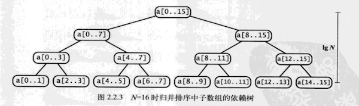
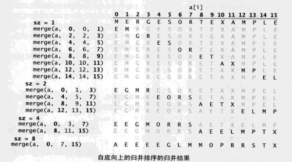
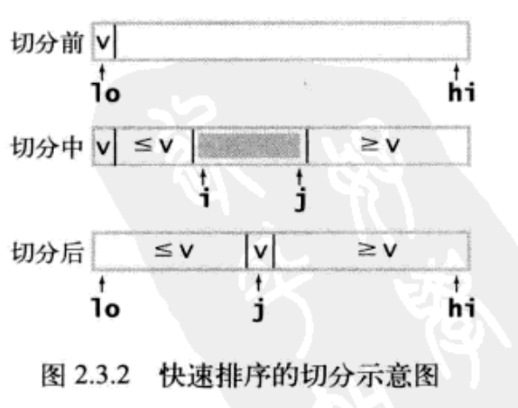
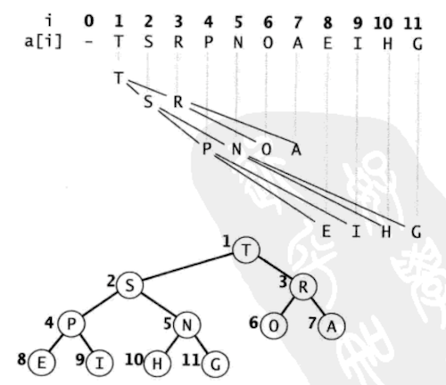
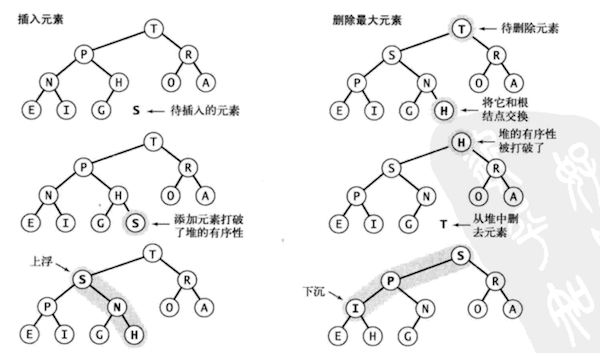

# 《算法》第二章排序学习笔记js实现

## 目录

- [选择排序](#user-content-选择排序)

- [插入排序](#user-content-插入排序)

- [归并排序](#user-content-归并排序)

- [快速排序](#user-content-快速排序)

- [优先队列](#user-content-优先队列)

- [堆排序](#user-content-堆排序)


> 对排序算法，我们重点关注比较次数和两个元素交换的次数，对于不交换元素的算法，我们重点关注访问数组的次数

### 选择排序

思想:循环找到数组中最小的元素，和第一个元素交换，在剩下的元素中找到最小的元素，和第二个元素交换，一直比较下去

```
    /**
 * 
 * @param {array} arr 
 * @param {number} x 
 * @param {number} y 
 */
function exchange(arr, x, y) {
    var t = arr[x]
    arr[x] = arr[y]
    arr[y] = t
}

/**
 * 
 * @param {array} arr 
 */
function selectsort(arr) {

    var n = arr.length

    arr.forEach(function (x, i) {
        var min = i
        for (var j = i + 1; j < n; j++) {
            if (arr[min] > arr[j]) {
                min = j
            }
        }
        exchange(arr, i, min)
    })
}

```

- 复杂度分析

```
 对于长度为N的数组
/**
 * i  内循环 比较次数
 * 0   N-1
 * 1   N-2
 * .
 * .
 * .
 * N-2 1
 * N-1 无
**/
```
所以排序N个元素,总的比较次数为: （N-1)(1+N-1)/2 = (N-1)N/2  ~N^2/2 (等差数列) 

每次循环都会交换1次，总的交换次数就是N

所以时间复杂度是`平方级`

选择排序的特点:

- [x] 运行时间与输入无关

- [x] 数据移动是最少的

### 插入排序

思想：将要排序的元素插入到有序序列的适当位置，和选择排序一样，当前索引左侧的元素都是有序的，但他们的最终位置还不确定，可能会被移动

```
/**
 * 
 * @param {array} arr 
 * @param {number} x 
 * @param {number} y 
 */
function exchange(arr, x, y) {
    var t = arr[x]
    arr[x] = arr[y]
    arr[y] = t
}

/**
 * 判断两个值的大小
 * @param {*} x 
 * @param {*} y 
 */
function less(x, y) {
    return x < y
}

/**
 * @param {array} arr 
 */
function insertsort(arr) {

    var n =arr.length

    arr.forEach((x, i) => {

        for (var j = i + 1; j < n && j > 0 && less(arr[j], arr[j - 1]); j--) {
            exchange(arr, j, j - 1)
        }

    })

    return arr
}

```

复杂度分析:

插入排序的效率和输入有关

在最好的情况下，元素都是有序的，则比较次数为N-1，交换次数为0

在最坏的情况下,元素都是逆序有序的

```
/**
 * 5 4 3 2 1
 * 4 5 3 2 1   第1次
 * 3 4 5 2 1   第2次
 * 
 * 外循环i   内循环j   比较   交换  
 * 0         1        1     1  
 * 1         2        2     2  
 * 2         3        3     3  
 * .
 * .
 * .
 * N-2       N-1      N-1   N-1
 * N-1       无   
 */
```

对于N个值的排序,总的比较次数 (1+N-1)(N-1)/2 = N(N-1)/2 ~ N^2/2 (等差数列) 

交换 和 比较一样

所以平均情况下 插入排序的时间复杂度也是`平方级`

### 归并排序

> 要将一个数组排序，要先（递归的）将它分成两半分别排序，再将结果归并起来，归并排序能够保证将任意长度为N的数组排序所需的时间和`NlogN`成正比,主要缺点是所需的额外空间和`N`成正比

- 自顶向下的归并排序

> 自顶向下的归并排序是应用`分治思想`的典型例子


```
function MergeSort(arr) {
    this.source = arr
    this.tempArr = new Array(arr.length).fill(0)
    this.init()
}

MergeSort.prototype.init = function () {
    var len = this.source.length
    this.sort(this.source, 0, len-1)
}

/**
 * 判断两个值的大小
 * @param {number} j 
 * @param {number} i 
 */
MergeSort.prototype.less = function (j, i) {
    return this.tempArr[j] < this.tempArr[i]
}

/**
 * 将两个有序数组合并成一个
 * @param {array} arr 
 * @param {number} start 
 * @param {number} min 
 * @param {number} end 
 */
MergeSort.prototype.merge = function (arr, start, min, end) {
    var i = start
    var j = min + 1
    for (var k = 0; k <= end; k++) {
        this.tempArr[k] = arr[k]
        this.tempArr.push(arr[k])
    }
    for (var k = start; k <= end; k++) {
        if (i > min) {
            arr[k] = this.tempArr[j++]
        } else if (j > end) {
            arr[k] = this.tempArr[i++]
        } else if (this.less(j, i)) {
            arr[k] = this.tempArr[j++]
        } else {
            arr[k] = this.tempArr[i++]
        }
    }
}
/**
 * 自顶向下的归并排序
 */
MergeSort.prototype.sort = function (arr, start, end) {
    if (start >= end) return
    var min = start + Math.floor((end - start) / 2)
    this.sort(arr, start, min)
    this.sort(arr, min + 1, end)
    this.merge(arr, start, min, end)
}

```

复杂度分析:



如图所示,树中的每个节点都表示一个sort()方法通过merge()归并而成立的子数组，这棵树正好有`n层`。

对于0 ~ n-1之间的任意k，自顶向下的第k层有`2^k`个子数组,每个数组的长度为2^n / 2^k = `2^(n-k)`，归并最多需要2^(n-k)次比较。

因此每层的比较次数为 2^k*2^n = 2^n次,n层共为`n*2^n`次

对位长度为N的数组,n为lgN(以2位底的对数表示为lg),所以 n*2^n = lgN*2^n = `NlgN`

- 自底向上的归并排序

> 实现归并排序的的另一种方法是先归并那些微型数组，然后再成对归并得到的子数组，直到将整个数组归并起来

```
less = function (j, i) {
    return tempArr[j] < tempArr[i]
}

function merge(arr, start, min, end) {
    var i = start
    var j = min + 1
    for (var k = 0; k <= end; k++) {
        tempArr[k] = arr[k]
        tempArr.push(arr[k])
    }
    for (var k = start; k <= end; k++) {
        if (i > min) {
            arr[k] = tempArr[j++]
        } else if (j > end) {
            arr[k] = tempArr[i++]
        } else if (less(j, i)) {
            arr[k] = tempArr[j++]
        } else {
            arr[k] = tempArr[i++]
        }
    }
}

//两两归并小数组
function sort(arr) {
    var n = arr.length
    for (var sz = 1; sz < n; sz += sz) {
        for (var i = 0; i < n - sz; i += sz + sz) {
            merge(arr, i, i + sz - 1, Math.min(i + sz + sz - 1, n - 1))
        }
    }

}
```




### 快速排序


> 快速排序是一种分治的排序算法，它将一个数组分成两个子数组，独立排序。快速排序和归并排序是互补的；在归并排序中，一个数组被等分成两半，在快速排序中，切分的位置取决于数组的内容。

> 快速排序的特点保存它是原地排序，且将长度为N的数组排序所需的时间和`NlgN`成正比

```

function quicksort(arr,start,end){

    if(start>=end) return 

    var j=partition(a,start,end) //确定切分点

    sort(arr,start,j)

    sort(arr,j+1,end)

}

```

该方法的关键在于切分，切分使得数组满足下面三个条件

- [x] 对于某个j,a[j]已经排好

- [x] a[start]到a[j-1]的所有元素都不大于a[j]

- [x] a[j+1]到a[end]的所有元素都不小于a[j]


切分的思想是: 先随意的取a[start]作为切分元素，然后从数组的左侧开始遍历，找到第一个不小于a[start]的元素，从数组的右侧开始遍历，找到第一个不大于a[start]的元素，将两个元素交换，继续左右两侧的遍历、交换，直到左右遍历相交，然后将相交位置的元素与a[start]交换



```
function less(x, y) {
    return x >= y
}

function exchange(arr, i, j) {
    var t = arr[i]
    arr[i] = arr[j]
    arr[j] = t
}

//切分算法
function partition(arr, start, end) {

    var i = start
    var j = end + 1
    var v = arr[start]
    while (true) {

        while (less(v, arr[++i])) {
            if (i == end) {
                break;
            }
        }
        while (less(arr[--j], v)) {
            if (j == start) {
                break
            }
        }
        if (i >= j) break
        exchange(arr, i, j)
    }
    exchange(arr, start, j)
    return j
}

```

### 优先队列

> 许多应用程序都需要处理有序的元素，但不一定要求它们全部有序，或是不一定要一次就将他们排序，在这种情况下，一个合适的数据结构应该支持两种操作，`删除最大的元素和插入元素`，这种数据类型叫做优先队列

定义优先队列API

MaxPQ | 定义
--- | ---
MaxPQ() | 创建一个优先队列
insert()| 插入一个元素
max()| 返回最大元素
delMax() | 删除并返回最大元素
isEmpty() | 队列是否为空
size()| 队列中元素个数

场景 TopK：

 输入N个数字，从中找出最大或最小的k个整数，在某些应用场景中，输入量可能非常巨大

 解决这个问题的一种方法是将输入排序然后从中找出K个最大的元素，但我们已经说明输入将会非常庞大，另一种办法是将每个新的输入和已知的K个最大的元素比较，但除非K较小，否则这种比较的代价会非常昂贵，只要我们能够高效的实现`insert()和delMin()`,我们就能使用优先队列解决这个问题。

 - 初级实现

 第一章讨论过的数组和链表是实现优先队列的起点

 1. 数组实现（无序）

    实现优先队列的最简单的方法是基于下压栈，insert()方法的代码和栈的push()一样，要实现删除最大元素，我们可以添加一段类似于选择排序的内循环的代码，`将最大元素和边界元素交换然后删除它`

```
    /**
 * 
 * @param {number} max 
 */
function MaxPQ(max) {
    this.container = []
}

MaxPQ.prototype.insert = function (v) {
    this.container.push(v)
}

MaxPQ.prototype.less = function (i, j) {
    return this.container[i] < this.container[j]
}

MaxPQ.prototype.exch = function (i, j) {
    var t = this.container[i]
    this.container[i] = this.container[j]
    this.container[j] = t
}

MaxPQ.prototype.delMin = function () {
    var min = 0
    var n = this.container.length
    //找到最小的元素
    for (var i = 1; i < n; i++) {
        if (this.less(i, min)) {
            min = i
        }
    }
    this.exch(min, this.container.length - 1)
    return this.container.pop()
}
MaxPQ.prototype.size = function () {
    return this.container.length
}
MaxPQ.prototype.isEmpty = function () {
    return !this.container.length
}

//用例 Top 6
var max = 6
var arr = []
var maxPQ = new MaxPQ(max + 1)
var input = [5, 7, 20, 18, 3, 1, 22, 53, 0, 6]
input.forEach(function (i) {
    maxPQ.insert(i)
    if (maxPQ.size() > max) {
        maxPQ.delMin()
    }
})
while (!maxPQ.isEmpty()) {
    arr.push(maxPQ.delMin())
}
console.log(arr)

//输出
[ 6, 7, 18, 20, 22, 53 ]
```  

 2. 数组实现（有序）

 另一种方法是在insert()方法中添加代码，`将所有较大的元素向右移动一格以使数组保持有序（和插入排序一样）`，这样，最大的元素总会在数组的一边，优先队列的删除就和栈的pop()操作一样

 3. 连边表示法

 和刚才一样，我们可以用基于链表的下压栈的代码作为基础，而后可以选择修改pop()来找到并返回最大的元素,或者修改push()来保证所有元素都是逆序有序的并用pop()来删除并返回链表的首元素

 对前者的实现:

 ```

function Node(item) {
    this.item = item
    this.next = null
}

function MaxPQ() {
    this.count = 0 //元素数量
    this.first = null //指向栈顶
}

MaxPQ.prototype.isEmpty = function () {
    return this.first == null
}
MaxPQ.prototype.size = function () {
    return this.count
}
MaxPQ.prototype.insert = function (ele) {
    var oldfirst = this.first
    var newnode = new Node(ele)
    newnode.next = oldfirst
    this.first = newnode
    this.count++
}
MaxPQ.prototype.delMin = function () {
    var minNode = this.first
    var nextNode = this.first.next
    var min
    //找到最小的元素节点
    while (nextNode) {
        if (this.less(nextNode, minNode)) {
            minNode = nextNode
        }
        nextNode = nextNode.next
    }
    //与首节点交换
    this.exch(this.first, minNode)
    min = this.first.item
    //删除首节点
    this.first = this.first.next
    this.count--
    return min
}
MaxPQ.prototype.exch = function (node1, node2) {
    var t = node1.item
    node1.item = node2.item
    node2.item = t
}

MaxPQ.prototype.less = function (node1, node2) {
    return node1.item < node2.item
}

//用例
var max = 5
var arr = []
var maxPQ = new MaxPQ()
var input = [5, 7, 20, 18, 3, 1, 22, 53, 0, 6]
input.forEach(function (i) {
    maxPQ.insert(i)
    if (maxPQ.size() > 6) {
        maxPQ.delMin()
    }
})
while (!maxPQ.isEmpty()) {
    arr.push(maxPQ.delMin())
}
console.log(arr)
 ```

> 我们刚刚讨论的所有初级实现中，插入元素和删除最小元素这两个操作之一在最坏情况下需要`线性时间`来完成

- ### 堆的定义

> 数据结构二叉堆能够很好的实现优先队列的基本操作，在二叉堆的数组中，每个元素都要保证大于等于另两个特定位置的元素

> 当一颗二叉树的每一个结点都大于等于它的两个子节点时，它被称为堆有序

> 完全二叉树：若设二叉树的深度为h,除第h层外，其他各层的结点数都达到了最大个数，第h层所有的结点都是连续集中在最左边

> 二叉堆是一组能够用堆有序的完全二叉树排序的元素，并在数组中按照层次存储

堆的表示



> 在一个堆中，位置k的结点的父结点的位置为k/2，而它的两个子节点的位置则为2k和2k+1，这样在不使用指针的情况下，我们也可以通过计算数组的索引在树中上下移动

- 堆的算法

由下至上的堆有序化(上浮)

如果堆的有序状态因为某个结点变得比它的父节点更大而被打破，我们就需要通过`交换它和它的父节点`来修复堆

```
function swim(k){
    while(k>1 && less(k/2,k)){
        exch(k/2,k)
        k=k/2
    }
}
```

由上至下的堆有序化(下沉)

如果堆的有序状态因为某个结点变得比它的两个子节点或是其中之一更小而被打破，我们就需要通过`将它和它的两个子节点中的较大者交换`来修复堆


```
function sink(k){
    while(2*k<=N){
        var j=2*k
        if(j<N && less(j,j+1)){
            j++
        }
        if(!less(k,j)) break;
        exch(k,j)
        k=j
    }
}
```

插入元素

> 将新元素加入数组末尾，增加堆的大小并让这个元素上浮到合适的位置

删除最大元素

> 从数组顶端删去最大元素并将数组的最后一个元素放到顶端，减小堆的大小并让这个元素下沉到合适的位置



算法实现

```

function MaxPQ() {
    this.container = []
    this.n = 0
}

MaxPQ.prototype.isEmpty = function () {
    return this.n == 0
}

MaxPQ.prototype.size = function () {
    return this.n
}

MaxPQ.prototype.less = function (i, j) {
    return this.container[i] > this.container[j]
}

MaxPQ.prototype.insert = function (el) {
    this.container[++this.n] = el
    //重新构建堆有序
    this.swim(this.n)
}

MaxPQ.prototype.delMin = function () {
    var min = this.container[1]
    this.exch(1, this.n--)
     //重新构建堆有序
    this.sink(1)
    return min
}

//下沉
MaxPQ.prototype.sink = function (k) {
    while (2 * k <= this.n) {
        var j = 2 * k
        if (j < this.n && this.less(j, j + 1)) {
            j++
        }
        if (!this.less(k, j)) break;
        this.exch(k, j)
        k = j
    }
}

//上浮
MaxPQ.prototype.swim = function (k) {
    while (k > 1 && this.less(Math.floor(k / 2), k)) {
        var half = Math.floor(k / 2)
        this.exch(half, k)
        k = half
    }
}

MaxPQ.prototype.exch = function (i, j) {
    var t = this.container[i]
    this.container[i] = this.container[j]
    this.container[j] = t
}

//用例
var arr = []
var maxPQ = new MaxPQ()
var input = [5, 7, 20, 18, 3, 1, 22, 53, 0, 6]
input.forEach(function (i) {
    maxPQ.insert(i)
    if (maxPQ.size() > 6) {
        maxPQ.delMin()
    }
})
while (!maxPQ.isEmpty()) {
    arr.push(maxPQ.delMin())
}
console.log(arr)

```

### 堆排序

我们可以把任意优先队列变成一种排序算法，将所有元素插入一个`查找最小元素`的优先队列，然后再重复调用`删除最小元素`的操作来将它们按顺序删去。用无序数组实现的优先队列这么做相当于进行一次选择排序，用基于堆的优先对立这样做就是`堆排序`

堆排序的两个阶段

- [x] 构造阶段，将原始数组重新组织安排进一个堆中

- [x] 下沉阶段，从堆中按递减顺序取出所有元素并得到排序结果

- 堆的构造阶段
 
 我们可以从左到右扫描数组，用swim()保证扫描指针左侧的所有元素已经是一颗堆有序的完全树

 ```
 function SortPQ(arr) {
    var n = arr.length
    for (var i = 1; i < n; i++) {
        swim(arr, i)
    }
}

 ```

一个更聪明高效的办法是从右至左的用sink()函数构造子堆，这个过程会递归的建立起堆的秩序

- 下沉排序阶段

堆排序的主要工作都在这个阶段，我们将堆中的最大元素(即a[1]位置元素)与最后一个元素交换，然后减小下一次a[1]元素下沉的重点，修复堆，重复这个过程，直到完成排序


- 堆排序实现

```
function Sort(arr) {
    this.container = [null].concat(arr)
}

Sort.prototype.less = function (i, j) {
    return this.container[i] < this.container[j]
}

Sort.prototype.exch = function (i, j) {
    var t = this.container[i]
    this.container[i] = this.container[j]
    this.container[j] = t
}

//下沉
Sort.prototype.sink = function (k, N) {
    while (2 * k <= N) {
        var j = 2 * k
        if (j < N && this.less(j, j + 1)) {
            j++
        }
        if (!this.less(k, j)) break;
        this.exch(k, j)
        k = j
    }
}

Sort.prototype.sort = function () {
    var n = this.container.length - 1
    for (var i = Math.floor(n / 2); i >= 1; i--) {
        this.sink(i, n)
    }
    while (n > 1) {
        this.exch(1, n--)
        this.sink(1, n)
    }
    return this.container.slice(1, this.container.length - 1)
}

//用例
var input = [, 5, 7, 20, 18, 3, 1, 22, 53, 0, 6]
var sort = new Sort(input)
console.log(sort.sort())

```

### 总结

本章的学习收获

- [x] 选择排序

- [x] 插入排序

- [x] 基于分治思想的归并排序的两种方式

- [x] 快速排序

- [x] 优先队列的定义及应用场景，例如解决TopK问题

- [x] 优先队列的基于数组或链表的初级实现

- [x] 二叉堆的定义及基于二叉堆的优先队列的实现

- [x] 基于二叉堆的优先队列排序-堆排序
