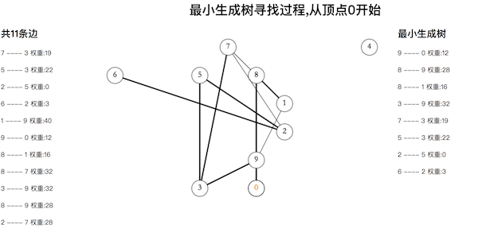
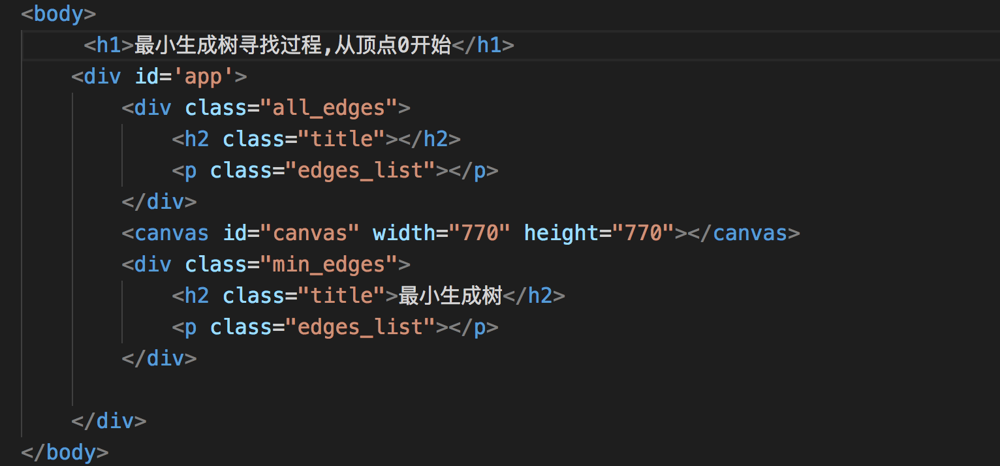
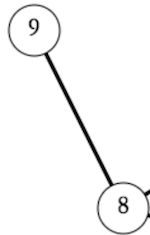

## 使用canvas来表示最小生成树寻路过程

[演示地址](https://xiyuyizhi.github.io/canvas_edge_weighted_graph/)

[源码](https://github.com/xiyuyizhi/canvas_edge_weighted_graph)

### 问题引入

在学习了加权无向图寻找最小生成树的算法之后，想通过可视化的方式来表示一个图的构造和最小生成树的寻路过程，就使用canvas来模拟了图的构造，连接边和加重显示最小生成树组成的边的过程

效果图



### 分析

整个过程可以分为三步

1. 通过canvas画圆圈来表示图的M个顶点，随机生成顶点的坐标

2. 随机生成N条边，通过canvas来连接每条边对应的两个顶点

3. prim算法寻找最小生成树，canvas加粗显示最小生成树中的边

### 实现



主要用到的canvas方法有`arc()`,`moveTo()`,`lineTo()`,`fillText()`以及修改样式和颜色

- 绘制顶点的位置

将canvas画布表示成一个(M+1)*(M+1)的二维数组，对于M个顶点，为每个顶点随机生成不大于M的两个二维数组的索引

顶点的表示

```
_random() {
        return {
            x: random(vertex) + 1,
            y: random(vertex) + 1
        }
    }
```

需要注意的是，因为是随机生成的，两个顶点在数组中的位置可能重复，所以遇到重复的情况，应该为顶点重新生成一个位置

大体过程

```
geneVertexAxis() {
        let i = 0
        const vertexList = []
        while (vertexList.length < vertex) {
            const p = this._random()
            if (this.axis[p.x][p.y] == -1) {
                this.axis[p.x][p.y] = i
                this.vertexPoints[i] = p
                vertexList.push(i)
                i++
            }
        }
    }
```

- 绘制边

同样通过random()来随机生成两个需要连接的顶点(不大于M)，并为这条边加一个权重，同时不能生成重复边, v-w 和 w-v视为同一条边

```
geneEdge() {
        for (let i = 0; i < edge; i++) {
            let v1 = random(vertex)
            let v2 = random(vertex)
            if (v1 !== v2) {
                let e = `${v1}-${v2}-${random(maxWeight)}`
                let eReverse = `${v2}-${v1}`
                if (!this._repeat(`${v1}-${v2}`) && !this._repeat(eReverse)) {
                    this.edgeList.push(e)
                }
            }
        }
    }
```

**重要的是:**

使用canvas来绘制圆，绘制直线都很简单，但这里，为了美观，在将两个顶点连接(即在两个圆之间画一条直线)时，对于直线，不能始于一个圆的圆心，止于另一个圆的圆心，而应该取两个圆与直线的焦点作为直线的两个端点



要做到这一点，需要借助数学中的勾股定理和等比三角形(O(∩_∩)O) 来求出焦点相对于圆心的横纵方向的偏移量

```
/**
 * 计算过两圆心的直线与圆的交点
 * @param {object} p1  圆心1位置
 * @param {object} p2  圆心2位置
 * @param {number} R   半径
 */

export function calculateInters(p1, p2, R) {
    const xAixsDis = Math.abs(p1.x - p2.x)
    const yAixsDis = Math.abs(p1.y - p2.y)
    const disOfTwoPoint = Math.sqrt(xAixsDis * xAixsDis + yAixsDis * yAixsDis).toFixed(2)
    const x = (R / disOfTwoPoint * xAixsDis).toFixed(2)
    const y = (R / disOfTwoPoint * yAixsDis).toFixed(2)

    let p1X = x
    let p1Y = y
    let p2X = x
    let p2Y = y
    
    if (p1.x <= p2.x && p1.y > p2.y) {
        p1Y = -p1Y
        p2X = -p2X
    }
    if (p1.x <= p2.x && p1.y <= p2.y) {
        p2X = -p2X
        p2Y = -p2Y
    }
    if (p1.x > p2.x && p1.y > p2.y) {
        p1X = -p1X
        p1Y = -p1Y
    }
    if (p1.x > p2.x && p1.y <= p2.y) {
        p1X = -p1X
        p2Y = -p2Y
    }

    return {
        p1Inters: {
            x: p1.x + Number(p1X),
            y: p1.y + Number(p1Y)
        },
        p2Inters: {
            x: p2.x + Number(p2X),
            y: p2.y + Number(p2Y)
        }
    }

```


- 加重最小生成树的边

使用prim算法求出最小生成树后，我们可以得到一组最小生成树中的顶点列表，然后将列表中的顶点对延时加粗绘制出来

```
_drawMinLine(edge, edges, i, vertexPoints) {
        const { ctx } = this
        ctx.lineWidth = 3
        setTimeout(() => {
            ctx.beginPath();
            let p1 = edge.v
            let p2 = edge.w
            this.showMinEdgesWeightInfo(edges, i)
            this._drawLine(vertexPoints[p1], vertexPoints[p2])
            ctx.stroke();
        }, (i + 1) * 1000)
    }
```


