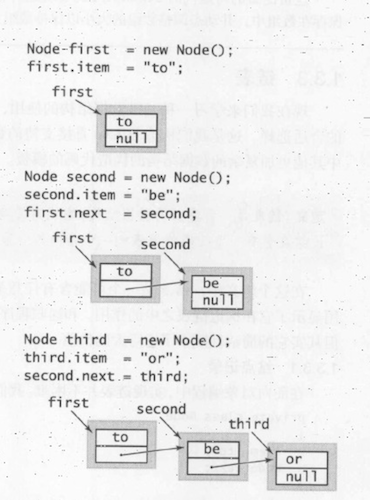
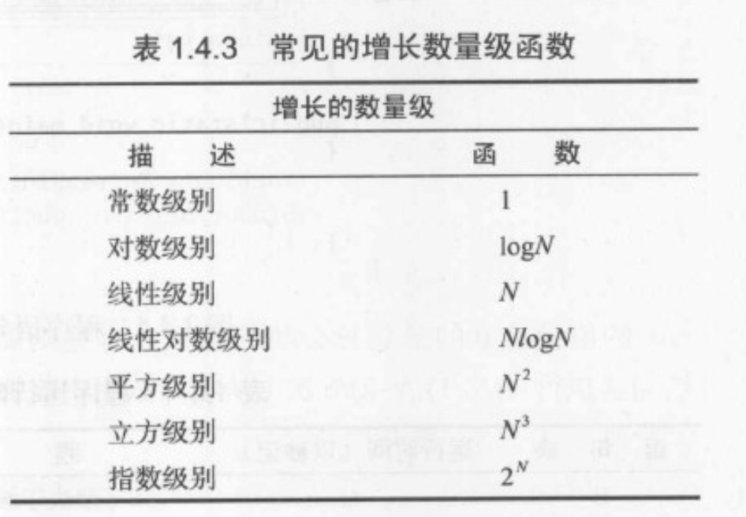

# 《算法》第一章学习笔记js实现

目标：总结本书主要内容，相应算法使用js来模仿实现

> 在计算机科学领域，我们用算法这个词来描述一种有限、确定、有效的并适合用计算机程序来实现的解决问题的方法。

> 我们关注的大多数算法都需要`适当地组织数据`，而为了组织数据就产生了`数据结构`

**原书所有代码是基于JAVA语法的，这里，我们使用js来实现所有算法逻辑**

## 队列、栈的实现

> 队列是一种先进先出的集合类型，栈是一种先进后出的集合类型

首先定义要实现的队列、栈的API

 **Queue** | 说明
--- | ---
Queue() | 创建空队列
enqueue(item) | 添加一个元素
dequeue()| 删除最近添加的元素
isEmpty() | 队列是否为空
size（）| 队列中元素的数量
iterator() | 返回一个可迭代对象
---

 **Stack** | 说明
--- | ---
Stack() | 创建空栈
push(item) | 添加一个元素
pop()| 删除最近添加的元素
isEmpty() | 栈是否为空
size（）| 栈中元素的数量
iterator() | 返回一个可迭代对象

---

Iterator | 说明 
--- | ---
hasNext() | 是否还有下一个元素 
next() | 返回下一个元素


- ### 数组方式

由于JS语言的特殊性，采用数组的方式来实现队列、栈是非常容易的,js中数组本来就提供了从头部插入、删除元素，从尾部插入、删除元素的功能。这里只需要简单的封装一下(js的弱类型特点，不需要像JAVA那样采用泛型来声明可以储存任意类型的数据，同时，js中数组是不定长的，可以动态扩展)

**实现**

队列的数组方式实现，并模拟可迭代功能

```
function Queue() {
    this.container = []
}
Queue.prototype.enqueue = function (ele) {
    this.container.push(ele)
}
Queue.prototype.dequeue = function () {
    return this.container.shift()
}
Queue.prototype.isEmpty = function () {
    return !this.container.length
}
Queue.prototype.size = function () {
    return this.container.length
}

Queue.prototype.iterator = function () {
    var container = this.container
    var current = 0
    return {
        hasNext: function () {
            return current !== container.length
        },
        next: function () {
            return container[current++]
        }
    }
}

用例:
var Qu = new Queue()
Qu.enqueue('to')
Qu.enqueue('be')
Qu.enqueue('or')
Qu.enqueue('not')
Qu.dequeue()
var iterator = Qu.iterator()
while (iterator.hasNext()) {
    console.log(iterator.next())
}
输出:
be
or
not

```

栈的数组方式实现，并模拟可迭代功能

```
 class Stack {

    constructor() {
        this.container = []
    }

    push(ele) {
        this.container.unshift(ele)
    }

    pop() {
        return this.container.shift()
    }

    isEmpty() {
        return !this.container.length
    }
    size() {
        return this.container.length
    }

    iterator() {
        const container = this.container
        let current = 0
        return {
            hasNext: function () {
                return current !== container.length
            },
            next: function () {
                return container[current++]
            }
        }
    }

}
用例:
var St = new Stack()
Stack.push('to')
Stack.push('be')
Stack.push('or')
Stack.push('not')
Stack.pop()
var iterator = Stack.iterator()
while (iterator.hasNext()) {
    console.log(iterator.next())
}
输出:
or
be
to
```

- ### 链表方式实现

> 链表是一种递归的数据结构，它或者为空(null)，或者是指向一个结点(node)的引用，该结点含有一个泛型的元素和一个指向另一个链表的引用。

在这个定义中，结点是一个可能含有任意类型数据的抽象实体，它所包含的指向结点的应用显示了它在构造链表之中的作用。

结点表示:

```
    function Node(){
        this.item=null
        this.next=null
    }
```

构造链表：



在表头插入结点
```
    var oldFirst=first
    first=new Node()
    first.next=oldFirst
```

从表头删除结点
```
    first=first.next
```

从表尾插入结点
```
    var oldlast=last
    lst=new Node()
    oldlast.next=last
```

> 实现任意插入和删除操作的标准解决方案是双向链表，其中每个结点都含有两个链接，分别指向不同的方向

- 栈的链表实现

```

function Node(item) {
    this.item = item
    this.next = null
}

function Stack() {
    this.count = 0 //元素数量
    this.first = null //指向栈顶
}

Stack.prototype.isEmpty = function () {
    return this.first == null
}
Stack.prototype.size = function () {
    return this.count
}
Stack.prototype.push = function (ele) {
    var oldfirst = this.first
    var newnode = new Node(ele)
    newnode.next = oldfirst
    this.first = newnode
    this.count++
}
Stack.prototype.pop = function () {
    var ele = this.first.item
    this.first = this.first.next
    this.count--
    return ele
}
Stack.prototype.iterator = function () {
    var firstnode = this.first
    var count = this.count
    return {
        hasNext: function () {
            return  count
        },
        next: function () {
            var ele=firstnode.item
            firstnode=firstnode.next
            count--
            return ele
        }
    }
}
用例：
var stack=new Stack()
stack.push('to')
stack.push('be')
stack.push('or')
stack.push('not')
stack.push('to')
stack.push('be')
console.log(stack.size())
var iterator=stack.iterator()
while(iterator.hasNext()){
    console.log(iterator.next())
}
输出：
6
be
to
not
or
be
to
```

- 队列的链表实现

> 将链表表示为一条从最早插入的元素到最近插入的元素的链表，实例变量first指向队列的开头，last指向队列的结尾。这样，要讲一个元素入列，就将它添加到表尾，要将一个元素出列，就删除表头的结点.

```
function Node(item) {
    this.item = item
    this.next = null
}

class Queue {

    constructor() {
        this.first = null
        this.last = null
        this.count = 0
    }

    isEmpty() {
        return this.first == null
    }
    size() {
        return this.count
    }
    enqueue(item) {
        const oldlast = this.last
        const last = new Node(item)
        this.last = last
        if (this.isEmpty()) {
            this.first = last
        } else {
            oldlast.next = last
        }
        this.count++
    }
    dequeue() {
        const ele = this.first.item
        this.first = this.first.next
        if (this.isEmpty()) {
            this.last = null
        }
        this.count--
        return ele
    }
    iterator() {
        let firstnode = this.first
        let count = this.count
        return {
            hasNext: function () {
                return count
            },
            next: function () {
                var ele = firstnode.item
                firstnode = firstnode.next
                count--
                return ele
            }
        }
    }
}
用例:
const queue=new Queue()
queue.enqueue('to')
queue.enqueue('be')
queue.enqueue('or')
queue.enqueue('not')
queue.enqueue('to')
queue.enqueue('be')
queue.dequeue()
console.log(queue.size())
const iterator=queue.iterator()
while(iterator.hasNext()){
    console.log(iterator.next())
}

输出:
5
be
or
not 
to
be
```

>在结构化存储数据集时，链表是数组的一种重要的替代方式，两者都非常基础，常常被称为顺序存储和链式存储。


## 常见的时间复杂度的级别




- ### threeSum问题分析

问题描述：

> 假设所有整数都不相同，统计一个数组中所有和为0的三整数元组的数量

- 最基本的实现,暴力算法

```
function threesum(arr){
    var N=arr.length
    var count=0
    for(var i=0;i<N;i++){
        for(var j=i+1;j<N;j++){
            for(var k=j+1;k<N;k++){
                if(arr[i]+arr[j]+arr[k]==0){
                    count++
                }
            }
        }
    }
    return count
}

```

分析：

执行最频繁的指令决定了程序执行的总时间，对上面的threesum算法，最频繁的部分就是if语句判断，它套在三个for循环内，对于给定的N，if语句执行次数为`N*(N-1)*(N-2)/6=N^3/6-N^2/2+N/3`,当N很大时，首项后的其他项都相对较小可以忽略，所以if语句的执行次数约等于`N^3/6`,表示为(~N^3/6)

所以暴力算法的threesum执行用时的增长数量级为`N^3`

- 优化

> 学习程序的增长数量级的一个重要动力是为了帮助我们为同一个问题设计更快的算法

改进后的算法的思路是：当且仅当-( a[i]+a[j] )在数组中( 不是a[i]也不是a[j] )时,整数对( a[i]和a[j] )为某个和为0的三元组的一部分。要解决这个问题，首先对数组进行排序(为二分查找做准备),然后对数组中的每个a[i]+a[j],使用二分查找算法对-(a[i]+a[j])进行二分查找，如果结果为k，且k>j,则count加一。

下面中的代码会将数组排序并进行N(N-1)/2次二分查找，每次查找所需的时间都和logN成正比，因此总的运行时间和N^2logN成正比。

```
//二分查找
function binarySearch(key, arr) {
    var start = 0
    var end = arr.length - 1
    while (start <= end) {
        var mid = start + Math.floor((end - start) / 2)
        if (key < arr[mid]) {
            end = mid - 1
        } else if (key > arr[mid]) {
            start = mid + 1
        } else {
            return mid
        }
    }
    return -1
}

function threesum(arr) {
    var N = arr.length
    var count = 0
    arr = arr.sort(function (a, b) {
        return a > b ? 1 : -1
    })
    for (var i = 0; i < N; i++) {
        for (var j = i + 1; j < N; j++) {
            if (binarySearch(-arr[i] - arr[j], arr) > j) {
                count++
            }
        }
    }
    return count
}
```

- 增长数量级的分类


## 案例研究:union-find算法

### 动态连通性问题

### 实现

- quick-find算法


- quick-union算法

- 加权 quick-union算法