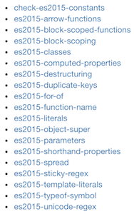

## babel小记

> 对babel一直没具体总结过，趁周末看了下文档，记录一下

babel作为一个compiler,主要用在转换新的es标准实现来使所有浏览器都支持，这包含两方面

1. 新的es标准语法，箭头函数、扩展运算符、块级作用域等

2. 转化新的es标准方法或正被提议还未纳入标准的方法，，Array.from、Map、Promise、String.includes等

### babel编译过程

babel的编译过程分为三个阶段，解析、转换、生成浏览器支持的代码。官网推荐了一个the-super-tiny-compiler,描述了类似babel这样的compiler大体是如何工作的。

- 解析 解析源代码，构造抽象语法树

- 转换 使用各种plugin处理AST，转换成一个新的AST

- 生成代码 根据新的AST，生成代码字符串

具体细节参见[the-super-tiny-compiler](https://github.com/jamiebuilds/the-super-tiny-compiler)


### 处理新的语法

对es新增语法的处理是借助babel的各种plugin，各种plugin作用在babel编译的第二个阶段，转化阶段

**presets**

`presets可以看做是一部分plugin的集合`，目前官方提供的presets有env、react、flow

在babel还不支持env之前，我们一般在.babelrc中指定

```
{
    presets:['es2015','es2016','stage-2']
}
```
像es2015表示babel会使用如下这些plugin处理我们代码中使用的新语法



现在我们可以这样写

```
{
    presets:['env']
}
```
等价于babel-preset-latest，可以转换已经在标准中的es6,es7等的新语法，`需要注意的是env并不会处理被提议的stage-x中的新语法，要使用那些语法要自己在presets中执行stage-x`

并且只是指定env，而不指定相关的targets信息的话，`babel只会转换新语法，对新方法不会做处理`

### 处理新的方法

#### babel-polyfill

为了支持es新增api的转化，我们可以使用babel-polyfill,这个库内部使用core-js(那个作者打广告说正在找工作的库)和regenerator来模拟实现新增api.

使用polyfill的缺点

1. polyfill需要首先被引入，在文件首部或者webpack中`entry: ["babel-polyfill", "./app/js"]`,整个文件会和我们src下的代码打包在一起，增大文件大小

2. polyfill会在js内置对象的原型上增加方法，例如String.prototpe.includes，污染全局作用域

一个减小使用polyfill后打包代码过大问题的方法 **useBuiltIns=true**

useBuiltIns默认不开启，开启后，我们`import "babel-polyfill"`会根据当前targets指定的环境引入必须的文件

```
import "babel-polyfill";

输出:根据环境

import "core-js/modules/es7.string.pad-start";
import "core-js/modules/es7.string.pad-end";
import "core-js/modules/web.timers";
import "core-js/modules/web.immediate";
import "core-js/modules/web.dom.iterable";

```
一定程度上减小打包文件大小

#### transform-runtime

使用babel-polyfill会有使打包文件过大和污染全局作用域的问题，所以babel提供了babel-plugin-transform-runtime来解决一些问题

1. 优化帮助函数引用

babel内部提供了很多帮助函数来处理语法转化的需要，transform-runtime会把对帮助函数的调用替换为对模块的引用

```
class Person {
}

输出：

"use strict";

function _classCallCheck(instance, Constructor) { if (!(instance instanceof Constructor)) { throw new TypeError("Cannot call a class as a function"); } }

var Person = function Person() {
  _classCallCheck(this, Person);
};

```

_classCallCheck是一个帮助函数，如果我们多个js文件中都有定义class类，_classCallCheck就会在多个文件中都存在,造成帮助函数重复，增大打包文件大小。而transform-runtime会将帮助函数以引用的方式调用(引用babel-runtime/helpers/xxx下面的)，避免重复


2. 对于新增api的转化，transform-runtime使用`babel-runtime/core-js下对应的同名方法`,而不需要引用babel-polyfill,只会需要哪个，就require哪个core-js下对应的实现.避免污染全局作用域

transform-runtime的缺点

因为不会在js原生对象原型上添加方法,所以transform-runtime不会转化新增的实例方法，例如不能处理`"foobar".includes("foo")`

### 对于新增api如何处理

如果项目中使用了大量新增api，并使用大量新增的实例方法，应该使用polyfill，`为了一定程度上减小打包文件的体积，应该启用useBuiltIns=true，并指定代码的最低运行环境，尽量减少不必要的polyfill`，同时加入transform-runtime，设置polyfill=false

```
{
    "presets":[
        ['env',{
            "targets":{
                "browsers": [
                    "last 2 versions",//各个浏览器的最新两个版本
                    "safari >= 7"
                ]
            },
            "debug": true,
            "useBuiltIns": true
        }]
    ],
    "plugins":[
        ["transform-runtime", { //不处理新的方法，只处理帮助函数
            "helpers": true,
            "polyfill": false,
            "regenerator": false,
            "moduleName": "babel-runtime"
        }]
    ]
}
```

如果项目并不使用新增实例方法(很少这样的情况),并不想污染全局作用域，应该使用transform-runtime

```
{
    "presets":['env'],//处理新的语法，但新的方法由transform-runtime插件处理
    "plugins":[
        ["transform-runtime", {
            "helpers": true,
            "polyfill": true,
            "regenerator": true,
            "moduleName": "babel-runtime"
        }]
    ]
}
```


