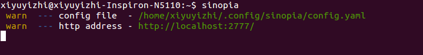

#使用Sinopia快速搭建私有npm仓库

[Sinopia github地址](https://github.com/rlidwka/sinopia)

Sinopia是一个私有的npm仓库服务,可以让我们快速的搭建自己的仓库

##使用

在服务器(例如:dev.company.com)上边

npm install -g Sinopia

命令行 sinopia 起服务 //默认Sinopia在4873端口启动服务,首次启动时会在.config/sinopia下创建config.yaml文件

config.yaml配置介绍

`

       storage:包的存放地址
       
       listen: 默认为4873
            listen:
                 - localhost:port //注意前面的 - ,不要遗漏
       
       uplinks:
          npmjs:
            url: https://registry.npmjs.org/  //此处可以修改,如果使用npm下载依赖比较慢的话,可以将此处的
                                              // url改成淘宝的 https://registry.npm.taobao.org/
       proxy: npmjs  //Sinopia在私有仓库找不到依赖时,会从npmjs指定的地址下载依赖
       
`
修改config.yaml后 要重新运行下sinopia

在本机,我们可以给npm 配置一下别名
在.bashrc或.profile中添加
alias lnpm="npm --registry=http://dev.company.com:port/" //地址就是sinopia服务所在的地址

现在我们就可以发布我们自己的包到私有库了

- 注册一下
  lnpm adduser
- 登录
  lnpm login
  lnpm whoami //查看当前登录用户
- coding
-发布
  lnpm publish

这样从http://dev.company.com:port/ 就能看到我们发布的包了   
  

