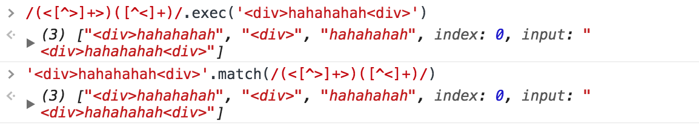

# 正则 理解这些点就够了

>不是完全的正则手册，只记录一些重要的,容易有误解的点

## 定义

正则表达式通过字面量形式或RegExp构造函数形式定义

```
const pattern=/\d/g
//或
const pattern = new RegExp('\d','g')
```

一般使用字面量形式，构造函数形式用在*正则表达式在运行时才能确定下的情况*,例如

```
function hasClass(ele, classname) {
    const pattern = new RegExp('(^|\\s)' + classname + '(\\s|$)')
    return pattern.test(ele.className)
}
```

另一方面:**字符串中反斜杠有别的含义,要想表示`\d`等要使用两个反斜杠来转义`\\d*`**

## 反斜杠

在正则表达式中反斜杠有重要的含义

1. 是用来转义有特殊含义的字符，比如 [、^、.

```
要想只匹配.com 需要 /\.com/.test('.com')
```

2. 预定的字符类以`\`开始，比如 \d \w \s

而在字符串中反斜杠同样是一个转义字符，\n \r \t

要想在字符串中表示\需要两个 \\

```
new RegExp("[\\w\\.]").toString()=='/[\w\.]/'
```

## ()、[]与|

[]:集合操作符，表示一系列字符的任意一个

例如:/[abc]/ 表示a、b、c中的任意一个能匹配就可以了

### 对于/[a|b]/呢？

一个常见的误区是感觉/[a|b]/表示**要匹配a或者b**,其实是a、b或者|中的任意一个

```
/[a|b]/.test('|') === true

/(a|b)/.test('|') ===false
```

从上面可以看到，**圆括号中的|是或的意思**,表示要匹配()以|分割的两边的*整体*，注意是整体

例子：

```
/(abc|abd)/.test('ab') ===false
/(abc|abd)/.test('abc') ===true
/(abc|abd)/.test('abd') ===true
```

## 分组和捕获

上面只是介绍了圆括号中存在|时需注意的点，这里重点说一下圆括号

**在正则中,圆括号有两种含义，一是用来分组，一是用来捕获想要的值**

1. 分组

（)结合* ？ + {} 使用时，是对圆括号内的整体进行repeat

```
/(ab)+/ 匹配一个或多个ab

/(ab)+|(cd)+/ 匹配一个或多个 ab或cd
```      

2. 捕获

捕获是一个强大的功能，也是很多时候我们使用正则的原因，同样以()来表示

例子:找出样式中的透明度值

```
<div id="opacity" style="opacity:0.5;filter:alpha(opacity=50);">

function getOpacity(elem) {
    var filter = elem.style.filter;
    if(filter){
        return filter.indexOf("opacity=") >= 0 ?(parseFloat(filter.match(/opacity=([^)]*)/)[1]) / 100) + "" : "" 
    }
    return elem.style.opacity
}
```

捕获主要结合exec()、match() 和 g标记使用，下面介绍

*需要强调的是，因为分组和捕获一样使用(),所以，在一个正则表达式中既有用于分组的(),也有用于捕获的()时，对于分组部分，可以加上**?:**,这样，结果集就只包含我们想要捕获的部分*

例子

```
'<div>hahahahah<div>'.match(/(<[^>]+>)([^<]+)/)
> [ <div>hahahahah , <div> , hahahahah ] //两个捕获

如果我们只对标签内的文本感兴趣

'<div>hahahahah<div>'.match(/(?:<[^>]+>)([^<]+)/)
> [ <div>hahahahah , hahahahah ] //对于<div>,我们不关心，就不要了
```

**说到?: 就要提一下长得差不多的 ?= 和 ?!**

?= 表示后面必须跟着某些东西,并且结果中不包含?=指定的部分，并且不捕获

?= 表示后面必须不跟着某些东西


对比看一下

```
/a(?:b)/.exec('abc')
> ["ab", index: 0, input: "abc"] //注意匹配的是"ab"

/a(?=b)/.exec('abc')
> ["a", index: 0, input: "abc"] //注意匹配的只是"a"
```

再看个例子,数字字符串转千分位

```
function formatNumber(str) {
  return str.replace(/\B(?=(\d{3})+$)/g, ',')
}
formatNumber("123456789")
> 1,234,567,890
```

解释:

1. \B表示**除了字符串首字母之前的边界**，比如1和2之间的边界，2和3之间的边界等

2. 后面()中的?=(\d{3})+$表示上面提到的那些边界后面**必须跟着3N个数字直到字符串尾部**

3. g表示全局匹配，即每个上面说的边界都要检测2，如果符合，replace把边界替换成,


## exec()、match()与g标记的故事

exec()和match()都是返回数组，结果集中包含捕获的内容

在正则中不包含g时，exec()和match()返回的结果集是一样的，**数组中依次是 整个匹配的字符串、依次的（）指定的要捕获的部分**



在有g的时候

**match()返回的数组中的每一项是依次匹配到的整体字符串，不包含每个匹配中捕获到的内容**

对比来看

```
"p123 q123".match(/\b[a-z]+(\d+)/)
> ["p123", "123", index: 0, input: "p123 q123"]

"p123 q123".match(/\b[a-z]+(\d+)/g)
> ["p123", "q123"]

```

可以看到加上g后，返回的数组就只有匹配项了


那么，即想匹配全部，又想获取到捕获怎么办呢？

**使用while结合exec()**

```
let pattern=/\b[a-z]+(\d+)/g
let str='p123 q123'
let match
while((match=pattern.exec(str)) !=null){
	console.log(match)
}

> ["p123", "123", index: 0, input: "p123 q123"]
  ["q123", "123", index: 5, input: "p123 q123"]
```

## replace()

对于字符串的replace方法,重点说一下，接受的第二个参数，可以是一个函数

对于`str.replace(/xxxxx/g,function(){})`

函数在每次前面的正则匹配成功时都会执行，函数的参数依次是，完整的匹配文本、依次的捕获部分、当前匹配的索引、原始字符串

```
"border-bottom-width".replace(/-(\w)/g,(match,capture)=>{
    return capture.toUpperCase()
})
> "borderBottomWidth"
```

