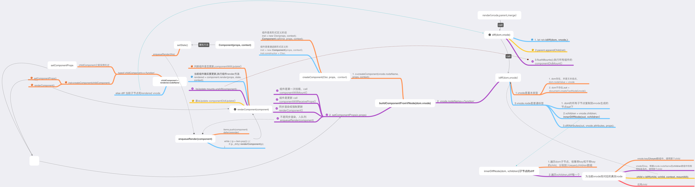

> 最近读了读preact源码，记录点笔记，这里采用例子的形式，把代码的执行过程带到源码里走一遍，顺便说明一些重要的点,建议对着preact源码看

## vnode和h()

虚拟结点是对真实DOM元素的`一个js对象表示`,由h()创建

h()方法在根据指定结点名称、属性、子节点来创建vnode之前,会对子节点进行处理，包括

1. 当前要创建的vnode不是组件,而是普通标签的话，文本子节点是null,undefined，转成'',文本子节点是number类型，转成字符串

2. 连续相邻的两个子节点都是文本结点，合并成一个


例如：
```
h('div',{ id: 'foo', name : 'bar' },[
            h('p',null,'test1'),
            'hello',
            null
            'world', 
            h('p',null,'test2')
        ]
)

对应的vnode={

    nodeName:'div',
    attributes:{
        id:'foo',
        name:'bar'
    },
    [
        {
            nodeName:'p',
            children:['test1']
        },
        'hello world',
        {
            nodeName:'p',
            children:['test2']
        }
    ]

}

```

## render()

render()就是react中的ReactDOM.render(vnode,parent,merge),将一个vnode转换成真实DOM,插入到parent中，只有一句话，重点在diff中

```
return diff(merge, vnode, {}, false, parent, false);
```

## diff

diff主要做三件事

1. 调用idff()生成真实DOM

2. 挂载dom

3. 在组件及所有子节点diff完成后，统一执行收集到的组件的componentDidMount()

**重点看idiff**

idiff(dom,vnode)处理vnode的三种情况

1. vnode是一个js基本类型值,直接替换dom的文本或dom不存在,根据vnode创建新的文本返回

2. vnode.nodeName是function 即当前vnode表示一个组件

3. vnode.nodeName是string 即当前vnode表示一个对普通html元素的js表示

一般我们写react应用，最外层有一个类似<App>的组件，渲染时`ReactDOM.render(<App/>>,root)`,这时候diff走的就是第二步，根据`vnode.nodeName==='function'`来构建组件,执行`buildComponentFromVNode()`,实例化组件，子组件等等


第三种情况一般出现在`组件的定义是以普通标签包裹的，组件内部状态发生改变了或者初次实例化时，要render组件了，此时，要将当前组件现有的dom与执行compoent.render()方法得到的新的vnode进行Diff,来决定当前组件要怎么更新DOM`

```
class Comp1 extends Component{

    render(){
        return <div>
                {
                    list.map(x=>{
                        return <p key={x.id}>{x.txt}</p>
                    })
                }
            <Comp2></Comp2>
        </div>
    }
    //而不是
    //render(){
    //    return <Comp2></Comp2>
    //}

}

```

### 普通标签元素及子节点的diff

**我们以一个真实的组件的渲染过程来对照着走一下`表示普通dom及子节点的vnode和真实dom之间的diff过程`**

假设现在有这样一个组件

```

class App extends Component {

  constructor(props) {
    super(props);
    this.state = {
      change: false,
      data: [1, 2, 3, 4]
    };
  }

 change(){
    this.setState(preState => {
        return {
            change: !preState.change,
            data: [11, 22, 33, 44]
        };
    });
 }

  render(props) {
    const { data, change } = this.state;
    return (
      <div>
        <button onClick={this.change.bind(this)}>change</button>
        {data.map((x, index) => {
          if (index == 2 && this.state.change) {
            return <h2 key={index}>{x}</h2>;
          }
          return <p key={index}>{x}</p>;
        })}
        {!change ? <h1>hello world</h1> : null}
      </div>
    );
  }
}

```

#### 初次渲染

**App组件初次挂载后的DOM结构大致表示为**

```
dom = {
   	tageName:"DIV",
   	childNodes:[
   		<button>change</button>
   		<p key="0">1</p>,
   		<p key="1">2</p>,
   		<p key="2">3</p>,
   		<p key="3">4</p>,
   		<h1>hello world</h1>
   	]
}

```

#### 更新

点击一下按钮，触发setState,状态发生变化,**App组件实例入渲染队列，一段时间后(异步的),渲染队列中的组件被渲染，实例.render执行,此时生成的vnode结构大致是**

```
vnode= {
	nodeName:"div"
	children:[
		{ nodeName:"button", children:["change"] },
		{ nodeName:"p", attributes:{key:"0"}, children:[11]},
		{ nodeName:"p", attributes:{key:"1"}, children:[22]},
 		{ nodeName:"h2", attributes:{key:"2"}, children:[33]},
		{ nodeName:"p", attributes:{key:"3"}, children:[44]},
	]
 }

//少了最后的h1元素，第三个p元素变成了h2

```

然后在**renderComponent方法内**diff上面的dom和vnode `diff(dom,vnode)`,此时在diff内部调用的idff方法内，执行的就是上面说的第三种情况**vnode.nodeType是普通标签**,关于renderComponent后面介绍

首先dom和vnode标签名是一样的，都是div(如果不一样,要通过vnode.nodeName来创建一个新元素，并把dom子节点复制到这个新元素下),并且vnode有多个children，所以直接进入innerDiffNode(dom,vnode.children)函数


innerDiffNode(dom,vchildren)工作流程

1. 对dom结点下的子节点遍历，根据是否有key，放入两个数组keyed和children(那些没有key放到这个里)

2. 遍历vchildren，**为当前的vchild找一个相对应的dom下的子节点`child`，例如，key一样的，如果vchild没有key，就从children数组中找标签名一样的**

3. child=idiff(child, vchild); 递归diff,根据vchild来得到处理后的child,将child应用到当前父元素dom下

接着看上面的例子

1. dom子节点遍历 得到两个数组

```
keyed=[
    <p key="0">1</p>,
   	<p key="1">2</p>,
   	<p key="2">3</p>,
   	<p key="3">4</p>
]
children=[
    <button>change</button>,
    <h1>hello world</h1>
]
```

2. 迭代vnode的children数组

存在key相等的

```
vchild={ nodeName:"p", attributes:{key:"0"}, children:[11]},
child=keyed[0]=<p key="0">1</p>

```

存在标签名改变的

```
vchild={ nodeName:"h2", attributes:{key:"2"}, children:[33]},
child=keyed[2]=<p key="2">3</p>,

```

存在标签名相等的

```
vchild={ nodeName:"button", children:["change"] },
child=<button>change</button>,

```

然后对vchild和child进行diff

```
child=idff(child,vchild)
```

**看一组子元素的更新**

看上面那组`存在keys相等的`子元素的diff,vchild.nodeName=='p'是个普通标签，所以还是走的idff内的第三种情况。

但这里vchild只有一个后代元素，并且child只有一个文本结点，可以明确是文本替换的情况，源码中这样处理,而不是进入innerDiffNode,算是一点优化

```
let fc = out.firstChild,
		props = out[ATTR_KEY],
		vchildren = vnode.children;

	if (props == null) {
		props = out[ATTR_KEY] = {};
		for (let a = out.attributes, i = a.length; i--;) props[a[i].name] = a[i].value;
	}

	// Optimization: fast-path for elements containing a single TextNode:
	if (!hydrating && vchildren && vchildren.length === 1 && typeof vchildren[0] === 'string' && fc != null && fc.splitText !== undefined && fc.nextSibling == null) {
		if (fc.nodeValue != vchildren[0]) {
			fc.nodeValue = vchildren[0];
		}
	}
```

所有执行`child=idiff(child,vchild)`后

```
child=<p key="0">11</p>
//文本值更新了
```

然后将这个child放入当前dom下的合适位置，一个子元素的更新就完成了


*如果vchild.children数组有多个元素，又会进行vchild的子元素的迭代diff*


至此，diff算是说了一半了，另一半是vnode表示一个组件的情况，进行组件渲染或更新diff


### 组件的渲染、diff与更新

和组件的渲染，diff相关的方法主要有三个，依次调用关系

**buildComponentFromVNode**

1. 组件之前没有实例化过，实例化组件，为组件应用props，setComponentProps()

2. 组件已经实例化过，属于更新阶段，setComponentProps()

**setComponentProps**

在setComponentProps(compInst)内部进行两件事

1. 根据当前组件实例是首次实例化还是更新属性来调用组件的componentWillMount或者componentWillReceiveProps

2. 判断是否时强制渲染，renderComponent()或者把组件入渲染队列，异步渲染

**renderComponent**

renderComponent内会做这些事:

1. 判断组件是否更新，更新的话执行componentWillUpdate(),

2. 判断shouldComponentUpdate()的结果，决定是否跳过执行组件的render方法

3. 需要render,执行组件render(),返回一个vnode,diff`当前组件表示的页面结构上的真实DOM`和返回的这个vnode，应用更新.(像上面说明的那个例子一样)


**依然从例子入手，假设现在有这样一个组件**

```
class Welcom extends Component{

    render(props){
        return <p>{props.text}</p>
    }

}

class App extends Component {

    constructor(props){
        super(props) 
        this.state={
            text:"hello world"
        }
    }

    change(){
        this.setState({
            text:"now changed"
        })
    }

    render(props){

        return <div>
                <button onClick={this.change.bind(this)}>change</button>
                <h1>preact</h1>
                <Welcom text={this.state.text} />
            </div>

    }

}

render(<App></App>,root)

vnode={
    nodeName:App,
}
```

**首次render**

render(`<App/>`,root)执行，进入diff(),vnode.nodeName==App,进入buildComponentFromVNode(null,vnode)

程序首次执行,页面还没有dom结构，所以此时buildComponentFromVNode第一个参数是null，**进入实例化App组件阶段**

```
c = createComponent(vnode.nodeName, props, context);
if (dom && !c.nextBase) {
    c.nextBase = dom;
    // passing dom/oldDom as nextBase will recycle it if unused, so bypass recycling on L229:
    oldDom = null;
}
setComponentProps(c, props, SYNC_RENDER, context, mountAll);
dom = c.base;

```

在setComponentProps中，执行component.componentWillMount(),组件入异步渲染队列，在一段时间后，组件渲染，执行
renderComponent()

```
rendered = component.render(props, state, context);

根据上面的定义，这里有

rendered={
    nodeName:"div",
    children:[
        {
            nodeName:"button",
            children:['change']
        },
        {
            nodeName:"h1",
            children:['preact']
        },{
            nodeName:Welcom,
            attributes:{
                text:'hello world'
            }
        }
    ]
}

```

nodeName是普通标签，所以执行

```
base = diff(null, rendered) 
//这里需要注意的是,renderd有一个组件child，所以在diff()-->idiff()[**走第三种情况**]---->innerDiffNode()中,对这个组件child进行idiff()时,因为是组件，所以走第二种情况,进入buildComponentFromVNode,相同的流程

component.base=base //这里的baes是vnode diff完成后生成的真实dom结构，组件实例上有个base属性，指向这个dom

base大体表示为

base={
    tageName:"DIV",
   	childNodes:[
        <button>change</button>
   		<h1>preact</h1>
        <p>hello world</p>
   	]
}

然后为当前dom元素添加一些组件的信息

base._component = component;
base._componentConstructor = component.constructor;

```

至此，初始化的这次组件渲染就差不多了,buildComponentFromVNode返回dom，即实例化的App的c.base,在diff()中将dom插入页面

**更新**

然后现在点击按钮,setState()更新状态，setState源码中

```
let s = this.state;
if (!this.prevState) this.prevState = extend({}, s);
extend(s, typeof state==='function' ? state(s, this.props) : state);
/**
* _renderCallbacks保存回调列表
*/
if (callback) (this._renderCallbacks = (this._renderCallbacks || [])).push(callback);
enqueueRender(this);

```
组件入队列了，延迟后执行renderComponent()

这次,在renderComponent中，**因为当前App的实例已经有一个base属性**,所以此时实例属于更新阶段`isUpdate = component.base =true`,执行实例的componentWillUpdate()方法，如果实例的shouldComponentUpdate()返回true，实例进入render阶段。

这时候根据新的props，state

```
rendered = component.render(props, state, context);

rendered={
    nodeName:"div",
    children:[
        {
            nodeName:"button",
            children:['change']
        },
        {
            nodeName:"h1",
            children:['preact']
        },{
            nodeName:Welcom,
            attributes:{
                text:'now changed' //这里变化
            }
        }
    ]
}

```

然后，像第一次render一样，`base = diff(cbase, rendered)`,但这时候，cbase是上一次render后产生的dom，即实例.base,然后页面引用更新后的新的dom.rendered的那个组件子元素(Welcom)同样执行一次更新过程,进入buildComponentFromVNode(),走一遍buildComponentFromVNode()-->setComponentProps()--->renderComponent()--->render()--->diff(),直到数据更新完毕


## 总结

preact src下只有15个js文件，但一篇文章不能覆盖所有点，这里只是记录了一些主要的流程，最后放一张有毒的图

