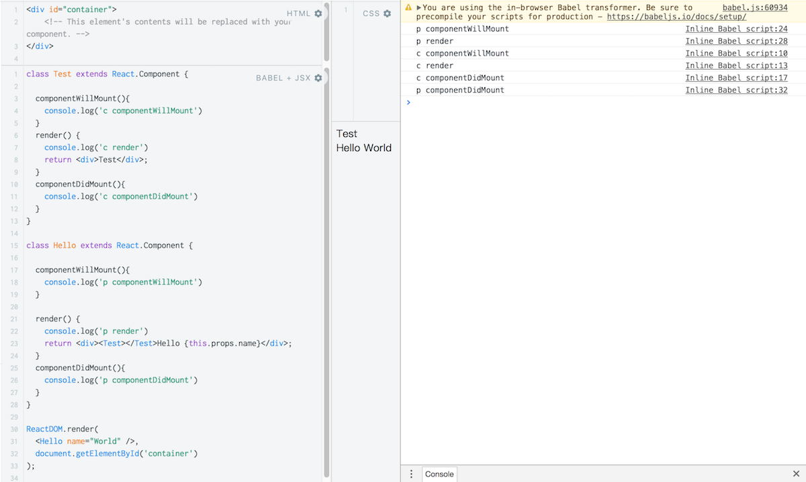
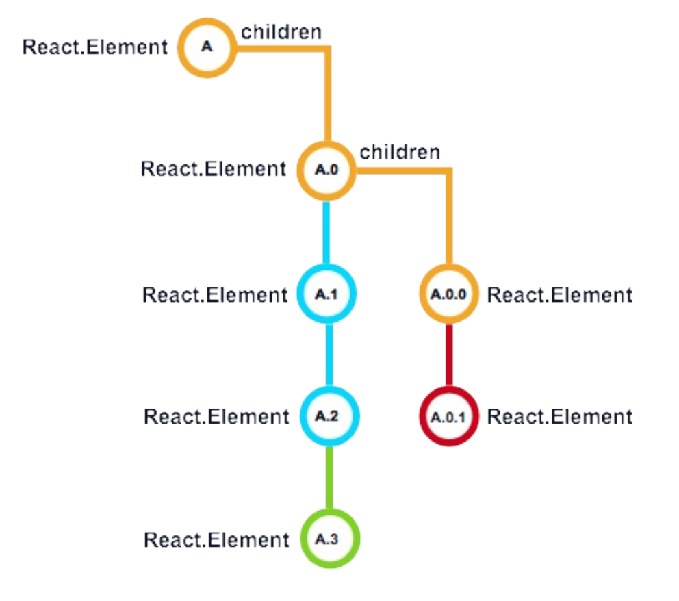

## react 主要内容总结

- JSX

- 虚拟DOM和diff算法

- 组件生命周期阶段

- 主要的钩子函数

### JSX

angularjs、vuejs中都是有使用html来做为模板的，而react换了个思路，使用了JSX。JSX是js的一种语法扩展，它将看上去像`页面标签元素的声明`转变成原生的js对象（React Element）并最终构建真实ROM,相对模板，JSX更加灵活


```
    const ele = <h1 className="greeting" >Hello World!</h1>
```

babel会将上面的jsx代码转换成

```
    const ele =React.createElement({
        'h1',
        {className: 'greeting'},
        'Hello World!'
    })
```

上面代码执行结果为

```
    const ele={
        type: 'h1',
        props: {
            className: 'greeting',
            children: 'Hello, world'
        }
    }
```

这种对象叫‘React elements’,`是React对html页面元素的一种表示方式`,也就是常说的`虚拟DOM`


### 虚拟DOM和diff算法

React之所以宣称速度快就是因为React不是实时的直接更新DOM元素，而是操作虚拟DOM

虚拟DOM是react中对真实DOM元素的一种轻量的对象表示，React使用虚拟DOM来寻找前一个渲染结果到后一个的最少步骤，最终才一次性生成真实的DOM

**diff算法要点**

[React’s diff algorithm](https://calendar.perfplanet.com/2013/diff/)

讲的很棒 [深度剖析：如何实现一个 Virtual DOM 算法](https://github.com/livoras/blog/issues/13)

1. 用js Object 表示 DOM tree

2. diff 算法比较 两个 virtual js Object 的差异 （ps: 只比较同层级的DOM）

3. 把差异应用到真正的DOM树上


### 组件及props和state

angularjs中我们有component和directive方法来定义组件,需要定义一大堆属性，react中就方便太多了

1. 函数式组件(就是通过普通函数的方式来定义的)

```
 function User(props){
     return (<div>
        
        <div>{props.user.name}</div>
     </div>)
 }
```

2. es6 Class

```
    class Welcome extends React.Component {
        render() {
            return <h1>Hello, {this.props.name}</h1>;
        }
    }
```

- props和state

react中组件之间的数据交互和angularjs也都类似，外层组件传递给子组件的数据在子组件中就通过`props`获取就行，而`state`代表了组件自己状态变化需要的`驱动数据`

使用`驱动数据`这个词是因为这些框架视图的交互都是声明式的，我们就是在通过改变数据来改变UI

props

1. 子组件通过props获取外层传递进来的数据

2. 外层组件通过传递一个callback函数来获取感兴趣的内部组件的数据

3. 平级组件之间可以借助一个更高层的组件来通信（Lifting State Up）

4. 但是如果组件的层级很深，一直传递回调函数的方式就显得比较凌乱，对于比较复杂的应用就要引入redux等这样的状态管理库

5. props是read only的

state

要使用state就不能使用上面说的`函数式的方式`来定义组件了,需要使用Class

使用state需要注意的几点

1. state对象中的数据变化只能通过setState()方法设置有效，组件才会重新render()

2. *setState()是一个异步的过程*

3. setState()两种形式，参数为对象或函数

```
    this.setState({users:[]})

    this.setState((prevState, props) => ({
        counter: prevState.counter + props.increment
    }));

```

4. state定义的时候可以有多个属性，setStete时可以只指定单个属性

### 组件生命周期阶段

- 挂载阶段(只进行一次)

1. 初始化props和state

2. componentWillMount()

3. render()

4. children 初始化和生命周期开始

5. componentDidMount()

- 更新阶段(多次执行)

1. componentWillReceiveProps()

2. shouldComponentUpdate()

3. componentWillUpdate()

4. render()

5. children 相应的更新阶段

6. componentDidUpdate()

- 卸载阶段(只进行一次)

1. componentWillUnmount()

2. children卸载

### 主要的钩子函数

- componentWillMount()

这个方法被调用的时候,render()方法还没执行，所有真实的DOM元素还没创建，所以不能访问dom，也不能访问子元素的refs

我们主要使用这个方法来更新state，根据props来做一些计算

`例如根据传递进来的props来设置当前组件的state`

另一个使用场景是注册全局事件，例如redux store,window resize事件

- render()

 render方法会返回`虚拟DOM对象`，在这里主要使用JSX来定义页面结构，render()存在于组件生命周期的多个阶段

 **需要注意的是** 应该保持render()方法为纯函数，即不能做`setState()`、`查询DOM元素`或者其他`改变组件state的操作`

 ```
 render() {
     // BAD: Do not do this!
    this.setState({ foo: 'bar' });

    // BAD: Don't do this either!
    let node = ReactDOM.findDOMNode(this);
    return (
        <div className={ classNames('person', this.state.mode) }>
        { this.props.name } (age: { this.props.age })
        </div>
    );
}
 ```
- componentDidMount()

这个方法在组件的所有children Elements 挂载到UI上并且当前组件挂载到UI 后调用

在这个阶段可以访问子元素的refs

*父子组件挂载阶段各个钩子函数调用顺序*



componentDidMount主要整合一些第三方库，操作DOM，ajax

```
import c3 from 'c3';
export default class Chart extends React.Component {
    componentDidMount() {
        this.chart = c3.generate({
            bindto: ReactDOM.findDOMNode(this.refs.chart),
            data: {
                columns: [
                    ['data1', 30, 200, 100, 400, 150, 250],
                    ['data2', 50, 20, 10, 40, 15, 25]
                ]
            }
        });
    } 
    render() {
        return (
            <div ref="chart"></div>
        );
    }
}
```

*有一些特殊的场景需要在组件挂载之后立即开始一次新的render,例如在一个data table 中动态计算行或列的宽高，根据计算的结果来重新定位子元素，这种时候，就需要在componentDidMount()中调用 this.setState()或者forceUpdate()*

更新阶段

*更新阶段触发的三种方式，改变props，改变state，调用forceUpdate()*

- componentWillReceiveProps(nextProps)

这里可以setState()根据nextProps,并且这个阶段是可以跳过的，当一个组件通过setState()来更新，这个函数不会执行

- shouldComponentUpdate(nextProps, nextState)

这里可以访问到nextProps, nextState,给我们提供了场地可以`加入判断`来决定是否进行更新，用于优化

- componentWillUpdate()

在新一次render(）之前调用，可以访问nextProps，nextState，并根据nextProps来做一些计算，但这里不能调用setState()

**重新渲染和子组件更新**

到了这里，组件就要重新render了，因为props和state都已经更新了，这次render就可以使用它们

不同于第一次渲染，React对生成虚拟DOM执行不同的操作



React比较`之前的虚拟dom对象`和`这次render新生成的虚拟dom对象`,react使用生成的key来匹配虚拟dom的每一个子元素，React决定我们是在新加A.3、删除A。0.1还是更新存在的实例A，A.0,A.0.0

如果前后两个虚拟DOM的相对应的元素key相同，react就传递props给这个已存在的实例，开始它的更新阶段，如果是新增了组件或key改变了，react就创建新的元素实例，这些新的元素实例就开始挂载阶段

- componenDidUpdate()

componenDidUpdate类似componentDidMount,用来操作第三个库，例如调用第三方库的更新方法

```
componentDidUpdate(prevProps, prevState) {
    // only update chart if the data has changed
    if (prevProps.data !== this.props.data) {
        this.chart = c3.load({
            data: this.props.data
        });
    }
}
```

- componentWillUnmount

用来解除全局的时间绑定，清除定时器等操作