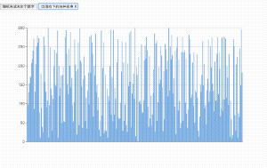
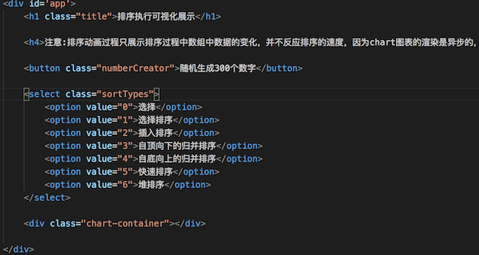

## Rxjs入门实践-各种排序算法排序过程的可视化展示


> 这几天学习下《算法》的排序章节，[具体见对排序的总结](../data_structure/algo2/algorithms2.md),想着做点东西，能将各种排序算法的排序过程使用Rxjs通过可视化的方式展示出来，正好练系一下Rxjs的使用

> 本文不会太多介绍Rxjs的基本概念，重点介绍如何用响应式编程的思想来实现功能

[在线演示地址](https://xiyuyizhi.github.io/rxjs-sort-visualization/)

[源码](https://github.com/xiyuyizhi/rxjs-sort-visualization)

效果图



### 需求



页面中包括一个随机生成300个数字的按钮和、一个选择不同排序算法的下拉列表和一个echart渲染的容器元素

点击按钮会随机生成300个随机数，同时页面渲染出300个数的柱状图，然后选择一种排序算法后，页面开始展示排序过程，在排序过程中如果我们切换成另一种排序算法，会停止当前算法的可视化展示，转而开始新的排序算法的可视化展示

### 思路

要展示出排序算法在排序过程中数组中数据的变化，我们要`定期保存一下排序过程中当前数组的快照`，然后通过echart展示当前数组的数据,重复这个过程直到排序完成，我们也就有了表示排序过程的一个动画展示

### 具体实现

在Rxjs中，一切皆是流，要实现这个功能，重要的是确定好数据流，以及数据流在未来一段时间内的变化过程

根据页面，可以清晰的确定几个数据流

按钮点击操作生成的数据流

```
const createNumber$ = Rx.Observable.fromEvent(query('.numberCreator'), 'click')
```

切换下拉列表生成的数据流

```
const select$ = Rx.Observable.fromEvent(query('.sortTypes'), 'change')
```

点击按钮生成随机数组并渲染echart图表很显然就用到map和do这两个operator

```
    createNumber$
    .map(e => {
        return numberCreator()
    })
    .do(nums => {
        const option = getOption(nums)
        echartInstance.setOption(option)
    })
    
```

切换下拉列表时我们要得到当前选择的排序算法的一个标识

```
let currentType
select$
    .map(e => e.target)
    .map(x => x.options[x.selectedIndex].value)
    .map(type => {
        return {
            type,
            timer:1
        }
    })
    .do(x => {
        currentType = x.type
    })

```

**下面是重点**

只点击按钮或者只切换下拉页面都不应该展示排序过程，只有当两个事件流都触发了，并且之后某一个再次触发的时候才会渲染排序过程的动画，所以我们需要`combineLatest`操作符,将两个数据流合并成一个

```
const combine$=Rx.Observable.combineLatest(
    createNumber$,
    select$
)
```
现在在combine$数据流中我们就有个随机数组和排序类型

[Array[300],'1']

然后就应该排序算法进行工作了，这里思考一下

- [] 怎样来生成我们排序算法排序过程中数据的快照？

- [] 生成的数据快照什么时候让echart来渲染？

对于第一点，我们需要将`排序算法封装成一个自定义的operator`,在排序过程中不断next() 数据快照,
到这里我们的数据流就变成能在`未来一段时间内不断生成新Value的一个数据流`

```

Rx.Observable.prototype.sort = function () {
    const input = this
    return Rx.Observable.create((observer) => {
        input.subscribe((arr) => {
            const nums = clone(arr[0])
            const select = arr[1]
            const sortMethod = sortTypes[select.type]
            sortMethod(nums, function (arr) {
                observer.next({
                    nums: JSON.parse(JSON.stringify(arr)),
                    select
                })
            }, error => {
                observer.error(error)
            })
        }, )

    })
}

combine$.sort()

```

对于第二点，因为排序算法是非常快的，如果我们subscibe sort()操作符产生的新值就开始渲染echart,页面上是看不出动画效果的，所以，我们需要`延迟echart渲染图表的过程`,我们需要将sort()触发的值`转变成一个异步的新事件流并打平到原数据流中`

```
combine$
    .sort()
    .flatMap(obj => {
        return Rx.Observable.of(obj).delay(100 * obj.select.timer++)
    })
```

`注意obj.select.timer++`，对于sort()前后触发的两个值，为了展示出echart渲染的动画，我们要给它们渲染的时间依次递增

到这一步，我们的单次功能就能正常进行了，但如果`在一个排序动画过程还没有结束，我们又点击了一个新的排序类型`，则新旧两次的还在`序列`中没进行的渲染都会依次进行，干扰echart渲染的效果，所以在切换到新的类型时，我们要过滤序列中的值。

```
combine$
    .sort()
    .flatMap(obj => {
        return Rx.Observable.of(obj).delay(100 * obj.select.timer++)
    })
    .filter(x => {
        return x.select.type == currentType
    })
    .do(x => {
        const option = getOption(x.nums)
        echartInstance.setOption(option)
    })
    .subscribe(() => { }, null, () => {
        console.log('complete')
    })
```

整个数据流序列

```   
   -createNumber$---------------------------------------------------------------------------------
 
   ---------------select$-------------------------------------------------------------------------
                             combineLatest()
   ---------------------------combine$------------------------------------------------------------
                              sort()
   ---------------------------v1       v2       v3       v4 .......v11      v22      v33----------
                                flatMap()
   ---------------------------delay1  delay2  delay3  delay4 ....delay11  delay22  delay33--------
                                 filter(currentType==type)
   ---------------------------delay1  delay2  delay11  delay22  delay33--------------------------

```


